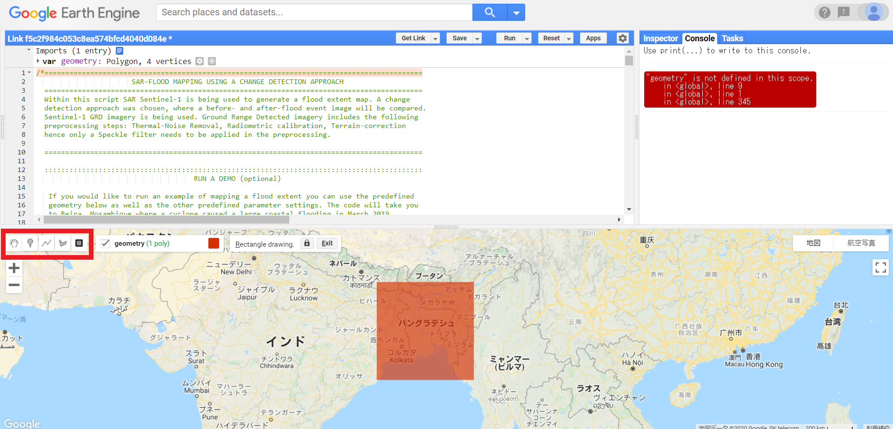

# コードを利用した洪水マップの作成

まずは以下のコードを自分の研究対象に書き換えてみましょう。  

(https://un-spider.org/advisory-support/recommended-practices/recommended-practice-google-earth-engine-flood-mapping/step-by-step)

対象エリア、対象期間は以下の方法で変更することができます。  
本サイトでは、バングラデシュで2017年3月から8月にかけて発生した洪水を研究対象の例としています。

## 対象エリア  

①地図上のツールバーの一番右(■)をクリックすると、研究対象エリアを四角形で囲むことができます。  

今回はバングラデシュを対象エリアとします。



②地図上のツールバーの右から2番目(5角形)をクリックすると、研究対象エリアにピンを立て、必要最低限のエリアを選択することが可能です。　　


## 対象期間  

洪水前後の日時(期間)を設定しましょう。  
＊entinel-11の周期のため、長期間を設定すると、画像のロード等に時間がかかる場合があります。 

本サイトでは、洪水の発生する前を3月、洪水が発生した時期を9月としています。

```
//洪水の発生前の時期を設定する
var before_start= '2017-03-01';
var before_end='2017-03-31';

//洪水の発生後の時期を設定する
var after_start='2017-09-01';
var after_end='2017-09-30';

```

## 各種設定　　

各種設定については、変更せずに使います。。詳細な説明は省略しますが、対象地域等により、必要がある場合のみ変更して利用してみてください。


SARセンサは縦方向の電磁波を送信します。縦波を単一平面(偏波)で送信することが可能です。洪水マッピングでは、ほとんどの場合VHが好まれます。  
VH:垂直送信、水平受信、VV:垂直送信、垂直受信  
```
var polarization = "VH"; /*or 'VV' 
```

パスの方向性
```
var pass_direction = "DESCENDING"; /* or 'ASCENDING'
```

差分画像に適用される閾値を定義します。(第3章で利用)
```
var difference_threshold = 1.25;
```

相対軌道
```
var relative_orbit = 79; 
```


