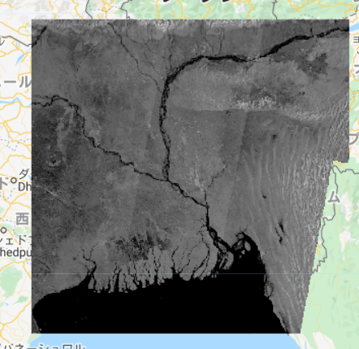
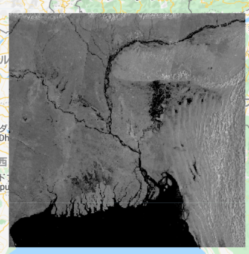

# データの選択と前処理

まずはGoogle earth engineの画面を見てみましょう。  
Google earth engineの画面は、大きく分けて以下の3パートに分かれています。

①  
<b>Code　Editor</b>：コードを入力する

②  
<b>Inspector</b>：マップ上に配置されたオブジェクトを検索する  

<b>Console</b>：生成されたマップやメッセージ(printした結果)が表示される  

<b>Tasks</b>:タスクをエクスポートする。その際、ファイル形式や解像度を設定することが可能  


③  
<b>Map</b>：<b>Code Editor</b>に入力したコードの結果等がGoogle Map上に表示される


<b>Code editor</b>に実行したいコードを入力し、【RUN】すると、<b>Console</b>に結果が出力され、<b>Map</b>上に表示されます。結果を保存したい場合には、<b>Console</b>から保存作業を行うと、自身のGoogle Drive上に結果が保存されるようになっています。  


## 対象画像の選択・出力と画像の前処理  

まずは、<b>使用する画像の選択と画像の前処理</b>を行います。  
本記事では簡単のため、画像の前処理についての詳細な説明は省略しますが、以下のコードは研究対象等によって変更することなく、そのまま使うことができます。

```
//ジオメトリーの名称を"aoi"に変更する 
var aoi = ee.FeatureCollection(geometry);    

// パラメーターを定義する前のSentinel-1 GRD(対象データ)をロードする
var collection= ee.ImageCollection('COPERNICUS/S1_GRD')

　//データの前処理
  .filter(ee.Filter.eq('instrumentMode','IW'))
  .filter(ee.Filter.listContains('transmitterReceiverPolarisation', polarization))
  .filter(ee.Filter.eq('orbitProperties_pass',pass_direction)) 
  .filter(ee.Filter.eq('resolution_meters',10))
  //.filter(ee.Filter.eq('relativeOrbitNumber_start',relative_orbit ))
  .filterBounds(aoi)
  .select(polarization);
```

第1章で設定した対象期間をもとに、データの中から必要な画像を取得しましょう。その後Consoleに出力し、Smoothingと呼ばれる処理を行います。

```
//対象期間のデータを選択する
var before_collection = collection.filterDate(before_start, before_end);
var after_collection = collection.filterDate(after_start,after_end);
```

Consoleに選択したデータを出力します。
```
//メタデータからデータを抽出する
  メタデータ：：主となるデータの説明書きが書いてあるデータ
      function dates(imgcol){
        var range = imgcol.reduceColumns(ee.Reducer.minMax(), ["system:time_start"]);
        var printed = ee.String('from ')
          .cat(ee.Date(range.get('min')).format('YYYY-MM-dd'))
          .cat(' to ')
          .cat(ee.Date(range.get('max')).format('YYYY-MM-dd'));
        return printed;
      }
      //Consoleに洪水前画像を出力する
      var before_count = before_collection.size();
      print(ee.String('Tiles selected: Before Flood ').cat('(').cat(before_count).cat(')'),
        dates(before_collection), before_collection);
      
      //Consoleに洪水後画像を出力する
      var after_count = before_collection.size();
      print(ee.String('Tiles selected: After Flood ').cat('(').cat(after_count).cat(')'),
        dates(after_collection), after_collection);
```
画像の前処理を行います。  

```
// 選択したタイルにモザイクをかけ、対象エリアをクリップする
クリップ：画像の指定した一部分のみを表示したり、その部分だけを切り抜いて残し、他の部分を消去する処理や操作

var before = before_collection.mosaic().clip(aoi);
var after = after_collection.mosaic().clip(aoi);

// Smoothing
Smoothing：時系列データはノイズを低減するために均す作業

var smoothing_radius = 50;
var before_filtered = before.focal_mean(smoothing_radius, 'circle', 'meters');
var after_filtered = after.focal_mean(smoothing_radius, 'circle', 'meters');

```  

以上の操作で生成された、洪水前(1枚目)、洪水後(2枚目)の画像をマップ上に表示してみましょう。マップ上に表示するためのコードは以下の通りです。

```
Map.centerObject(aoi,8);
Map.addLayer(before_filtered, {min:-25,max:0}, 'Before Flood',0);
Map.addLayer(after_filtered, {min:-25,max:0}, 'After Flood',1);
```



  



2枚を比較して見ると、洪水前後で少し違いが見られますね。次の章からは、別のデータセットを追加し、実際に洪水による浸水域を検出していきます。