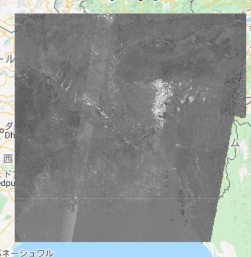
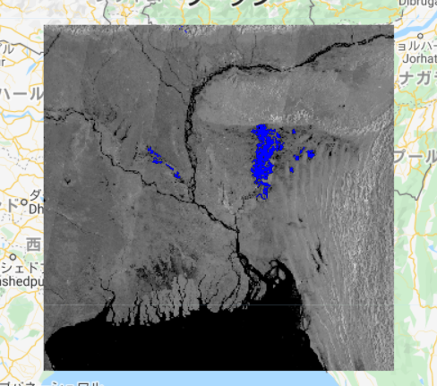

# 浸水範囲の算出

JRCレイヤー、HydroSHEDSを使って、浸水範囲を検出、面積を算出する方法を説明します。  

<b>JRC Global Surface Water Mapping Layers, v1.2</b>：1984年から2019年までの表層水の位置と時間的分布のマップが含まれており、それらの水面の広がりと変化に関する統計を提供している。

<b>WWF/HydroSHEDS/03VFDEM</b>：HydroSHEDSは、地域規模および地球規模のアプリケーションのための水文情報を一貫したフォーマットで提供するマッピング製品。河川ネットワーク、流域境界、排水方向、流量累積など、様々なスケールの地理参照データセット（ベクトルとラスター）を提供し、NASAのシャトルレーダー地形ミッション（SRTM）によって2000年に取得された標高データに基づいている。

## 洪水前後の画像を比較する　　

洪水前後の画像を比較し、洪水による浸水域を検出してみましょう。  

まず、洪水前後の画像の差を調べます。あらかじめ定義した基準となる値(第1章)と各値を比較することによって、洪水前後の変化有無を判定します。

```
var difference = after_filtered.divide(before_filtered);

var threshold = difference_threshold;

//gtでthreshold以上のものを1それ以外を0とする二値画像を作成
var difference_binary = difference.gt(threshold); 
```

作成したDifference layerをマップ上に表示してみましょう。
```
Map.addLayer(difference,{min:0,max:2},"Difference Layer",0);
```



ほかのデータセットを使って、さらに結果の精度を高めていきましょう。
```
// JRCレイヤーを利用して、parmanent water(洪水に関わらず、常にある水)を検出する。
      var swater = ee.Image('JRC/GSW1_0/GlobalSurfaceWater').select('seasonality');
      var swater_mask = swater.gte(10).updateMask(swater.gte(10));　
      
      // 多年水域(水量＞10か月/年)を０とする浸水層を抽出する
      var flooded_mask = difference_binary.where(swater_mask,0);
      // 洪水による浸水範囲を抽出する
      var flooded = flooded_mask.updateMask(flooded_mask);
      
      // ピクセルの接続性を計算(洪水範囲プロダクトのノイズを低減する操作)
      var connections = flooded.connectedPixelCount();    
      var flooded = flooded.updateMask(connections.gte(8));
      
      // デジタル標高モデルを使用して、5％以上の傾斜がある領域を抽出する
      var DEM = ee.Image('WWF/HydroSHEDS/03VFDEM');
      var terrain = ee.Algorithms.Terrain(DEM);
      var slope = terrain.select('slope');
      var flooded = flooded.updateMask(slope.lt(5));
```

以上の操作で生成されたFlooded areaをマップ上に表示してみましょう。  
青い部分が洪水による浸水被害があった地域です。今回は洪水開始前を3月、洪水終了後を9月に設定しているため、浸水地域は実際の被害範囲より狭いですが、洪水終了時期を7月や8月に設定すると、さらに広い浸水範囲を検出することができます。

```
Map.addLayer(flooded,{palette:"0000FF"},'Flooded areas');
```





## 浸水した地域の面積を算出

上記の作業で洪水によって浸水した地域がわかりました。それでは次は、浸水した地域の面積を計算してみましょう。

```
// それぞれのピクセルの地域情報を含んだラスターレイヤーを作成 
var flood_pixelarea = flooded.select(polarization)
  .multiply(ee.Image.pixelArea());

// 演算時間を減らすため、デフォルト設定
＊正確な結果を算出したい場合は、”bestEffort”をfalseに設定し、maxPixelsを増加させる
var flood_stats = flood_pixelarea.reduceRegion({
  reducer: ee.Reducer.sum(),              
  geometry: aoi,
  scale: 10, // native resolution 
  //maxPixels: 1e9,
  bestEffort: true
  });

// メートルをヘクタールに変換  
var flood_area_ha = flood_stats
  .getNumber(polarization)
  .divide(10000)
  .round(); 

```