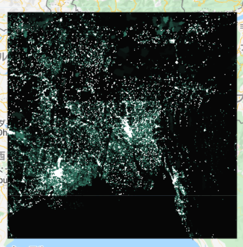
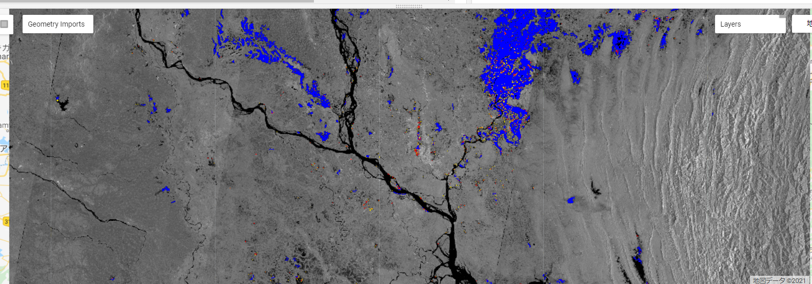
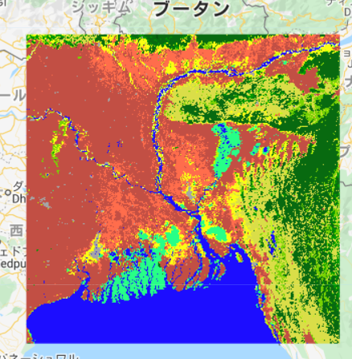
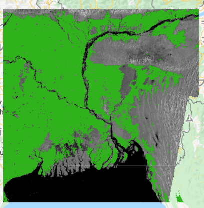
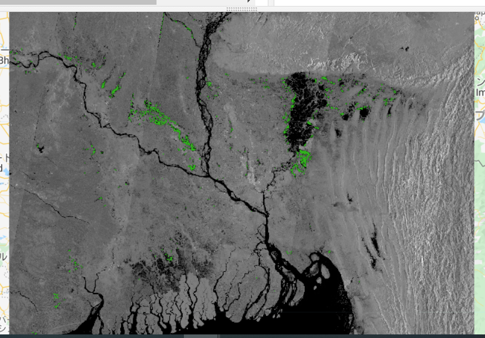
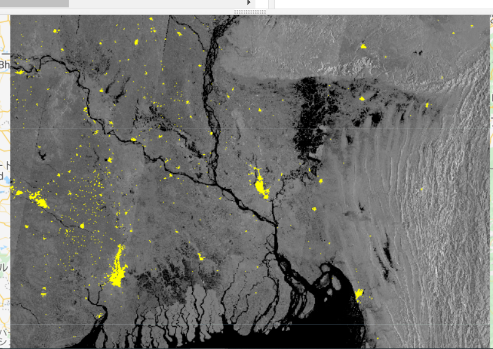
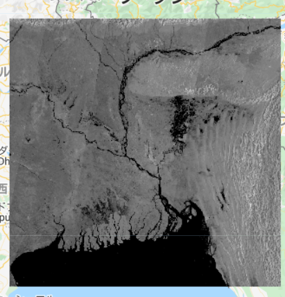

# 被害評価　　

この章では、各ピクセルにおける被害状況を算出する方法を説明します。

<b>"Estimated number of exposed people"</b>：洪水の影響を受けた推定人口

<b>"Estimated affected cropland"</b>：影響を受けた耕作地の推定面積　　

<b>"Estimated affected urban area"</b>：影響を受けた都市の推定面積


＊マップ上の表示に当たって、着色をしていますが、自由に設定することができます。

## "Estimated number of exposed people"

JRC Global Human Settlement Popluation Density layerを利用して、洪水の影響を受けた人口を算出します。  

<b>JRC Global Human Settlement Popluation Density layer</b>：参照期間（1975年、1990年、2000年、2015年）の人口分布と密度を、1セルあたりの人口数で表したもの　　

```
// JRCレイヤー(JRC Global Human Settlement Popluation Density layer)をロードする
Resolution: 250. 　//分解能
var population_count = ee.Image('JRC/GHSL/P2016/POP_GPW_GLOBE_V1/2015').clip(aoi);
```

JRCレイヤーによって算出した人口密度を表示してみましょう.首都ダッカに近いところほど白くなっていて、人口密度が高いことががわかります。

```
Map.addLayer(population_count, populationCountVis, 'Population Density',0);
```



### 被害人口を算出する

```
// GHSL(the Global Human Settlement Layer))を投影する
var GHSLprojection = population_count.projection();

// GHSLスケールに洪水レイヤーをリプロジェクトする
リプロジェクト:座標系の変換操作

var flooded_res1 = flooded
    .reproject({
    crs: GHSLprojection
  });

// the resampled flood layerを使い、被害人口を示すレイヤーを作成する
var population_exposed = population_count
  .updateMask(flooded_res1)
  .updateMask(population_count);
```
Exposed Populationを表示してみましょう。少し見づらいですが、先ほど表示した洪水浸水域の周辺に点描されていることがわかります。

```
var populationExposedVis = {
  min: 0,
  max: 200.0,
  palette: ['yellow', 'orange', 'red'],
};
Map.addLayer(population_exposed, populationExposedVis, 'Exposed Population');
```

被害人口ラスターのピクセルあたりの数値を計算します。
```
var stats = population_exposed.reduceRegion({
  reducer: ee.Reducer.sum(),
  geometry: aoi,
  scale: 250,
  maxPixels:1e9 
});
```

被害人口を整数値にします。
```
var number_pp_exposed = stats.getNumber('population_count').round();
```

##  "Estimated affected cropland" 
まず、MODIS Land Coverをロードし、設定を行います。  
今回はMODIS Land Cover Type Yearly Global 500mを使用します。
```
var LC = ee.ImageCollection('MODIS/006/MCD12Q1')
  .filterDate('2014-01-01',after_end) 　　//日時の設定
  .sort('system:index',false)　　　　　 　
  .select("LC_Type1")　　　　           　//Layersの指定
  .first()                                
  .clip(aoi);　　　　　　　　           　//画像をジオメトリにクリップする
```

MODIS Land Coverをマップ上に表示してみましょう。
植生指数の値が小さければ小さいほど、植生がない/少ない(水や雪など)を表し、大きくなればなるほど豊かな植生(森林など)ということを示しています。以下の図の通り、豊かな植生を濃緑、植生がない/少ない地域を青で塗分けています。

```
var LCVis = {
  min: 1.0,
  max: 17.0,
  palette: [
    '05450a', '086a10', '54a708', '78d203', '009900', 'c6b044', 'dcd159',
    'dade48', 'fbff13', 'b6ff05', '27ff87', 'c24f44', 'a5a5a5', 'ff6d4c',
    '69fff8', 'f9ffa4', '1c0dff'
  ],
};
Map.addLayer(LC, LCVis, 'Land Cover',0);
```




続いて、 the classes cropland (>60%) and Cropland/Natural である耕作地だけを抽出してみましょう。
 
```
var cropmask = LC  
  .eq(12)          //与えられた値と等しいメタデータにフィルターをかける
  .or(LC.eq(14))　 
var cropland = LC
  .updateMask(cropmask)　
```

croplandをマップ上に表示してみましょう。緑で着色された部分がCroplandとして検出された地域です。
```
var croplandVis = {
  min: 0,
  max: 14.0,
  palette: ['30b21c'],
};
Map.addLayer(cropland, croplandVis, 'Cropland',0) 
```


先ほど同様に、今度はAffected croplandを抽出してみましょう。
```
// MODISを投影させる
var MODISprojection = LC.projection();

// MODISスケールにflood layerをリプロジェクトする
var flooded_res = flooded
    .reproject({
    crs: MODISprojection
  });

// the resampled flood layerを使って、Affected croplandを抽出する
var cropland_affected = flooded_res
  .updateMask(cropland)
```

Affected croplandをマップ上に表示してみましょう。
```
Map.addLayer(cropland_affected, croplandVis, 'Affected Cropland');
```


耕作地における浸水被害面積を算出します。
```
// affected cropland layerのピクセルを取得する
var crop_pixelarea = cropland_affected
  .multiply(ee.Image.pixelArea()); //calcuate the area of each pixel 

// affected cropland layerのピクセルを足し合わせる
var crop_stats = crop_pixelarea.reduceRegion({
  reducer: ee.Reducer.sum(), //sum all pixels with area information                
  geometry: aoi,
  scale: 500,
  maxPixels: 1e9
  });
  
// ヘクタールに換算する
var crop_area_ha = crop_stats
  .getNumber(polarization)
  .divide(10000)
  .round();
```


##  "Estimated affected urban area"

同様に都市部についても浸水被害地域を抽出し、被害面積を算出します。

```
// 都市エリアをフィルターにかける
var urbanmask = LC.eq(13)
var urban = LC
  .updateMask(urbanmask)
```
Urbanをマップ上に表示してみましょう。都市部のバングラデシュ・ダッカやインド・コルカタ周辺が黄色く着色されています。
```
var urbanVis = {
  min: 0,
  max: 13.0,
  palette: ['yellow'],
};
Map.addLayer(urban, urbanVis, 'Urban',0)
```


the resampled flood layerを使って、Affected urbanを抽出します。
```
var urban_affected = urban
  .mask(flooded_res)
  .updateMask(urban);
```
affected urbanをマップ上に表示してみましょう。
```
Map.addLayer(urban_affected, urbanVis, 'Affected Urban');
```


最後に、都市部における浸水被害面積を算出します。
```
// affected urban layerのピクセルを取得する
var urban_pixelarea = urban_affected
  .multiply(ee.Image.pixelArea()); //calcuate the area of each pixel 

// affected cropland layerのピクセルを集計する
var urban_stats = urban_pixelarea.reduceRegion({
  reducer: ee.Reducer.sum(), //sum all pixels with area information                
  geometry: aoi,
  scale: 500,
  bestEffort: true,
  });

//　ヘクタールに換算する
var urban_area_ha = urban_stats
  .getNumber('LC_Type1')
  .divide(10000)
  .round();
```