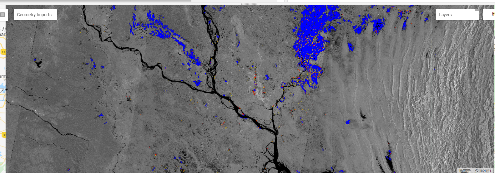
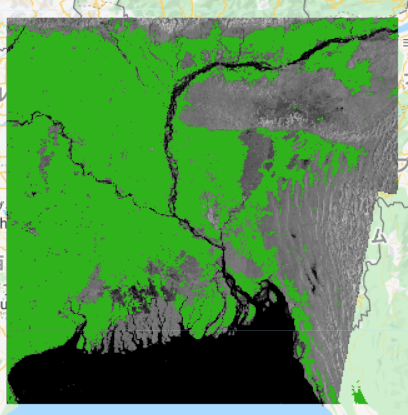

--- 
title: "GEE学習サイト"
author: "Tamaki.M"
date: "`r Sys.Date()`"
site: bookdown::bookdown_site
documentclass: book
bibliography: [book.bib, packages.bib]
biblio-style: apalike
link-citations: yes
description: "GEEを活用して洪水被害図を作成してみましょう"
---

# 初めに {-}

このサイトは、Google earth engineを活用して洪水による浸水被害範囲図を作成する方法について、UN Spiderが提供しているコードにのっとって説明をしています。ただし、本記事では説明のため、UN spiderのコードとは順番を入れ替えている部分があります。  

元のサイトは、以下のURLから確認できます。
(https://un-spider.org/advisory-support/recommended-practices/recommended-practice-google-earth-engine-flood-mapping/step-by-step)

コードを詳しく知る前に、まずはどのようなものが出来上がるのか確認したいという方は、以下のサイトに従って作成してみてください。
(https://tamak1313.github.io/cosmobook/)

## 対象者

+ 衛星データ初心者  

+ GEE初心者  

## 作業環境

2020年12月現在  

Windows 10 64bit

<!--chapter:end:index.Rmd-->

# コードを利用した洪水マップの作成

まずは以下のコードを自分の研究対象に書き換えてみましょう。  

(https://un-spider.org/advisory-support/recommended-practices/recommended-practice-google-earth-engine-flood-mapping/step-by-step)

対象エリア、対象期間は以下の方法で変更することができます。  
本サイトでは、バングラデシュで2017年3月から8月にかけて発生した洪水を研究対象の例としています。

## 対象エリア  

①地図上のツールバーの一番右(■)をクリックすると、研究対象エリアを四角形で囲むことができます。  

今回はバングラデシュを対象エリアとします。


②地図上のツールバーの右から2番目(5角形)をクリックすると、研究対象エリアにピンを立て、必要最低限のエリアを選択することが可能です。　　


## 対象期間  

洪水前後の日時(期間)を設定しましょう。  
＊entinel-11の周期のため、長期間を設定すると、画像のロード等に時間がかかる場合があります。 

本サイトでは、洪水の発生する前を3月、洪水が発生した時期を9月としています。

```
//洪水の発生前の時期を設定する
var before_start= '2017-03-01';
var before_end='2017-03-31';

//洪水の発生後の時期を設定する
var after_start='2017-09-01';
var after_end='2017-09-30';

```

## 各種設定　　

各種設定については、変更せずに使います。。詳細な説明は省略しますが、対象地域等により、必要がある場合のみ変更して利用してみてください。


SARセンサは縦方向の電磁波を送信します。縦波を単一平面(偏波)で送信することが可能です。洪水マッピングでは、ほとんどの場合VHが好まれます。  
VH:垂直送信、水平受信、VV:垂直送信、垂直受信  
```
var polarization = "VH"; /*or 'VV' 
```

パスの方向性
```
var pass_direction = "DESCENDING"; /* or 'ASCENDING'
```

差分画像に適用される閾値を定義します。(第3章で利用)
```
var difference_threshold = 1.25;
```

相対軌道
```
var relative_orbit = 79; 
```


<!--chapter:end:01-intro.Rmd-->

# データの選択と前処理

まずはGoogle earth engineの画面を見てみましょう。  
Google earth engineの画面は、大きく分けて以下の3パートに分かれています。

①  
<b>Code　Editor</b>：コードを入力する

②  
<b>Inspector</b>：マップ上に配置されたオブジェクトを検索する  

<b>Console</b>：生成されたマップやメッセージ(printした結果)が表示される  

<b>Tasks</b>:タスクをエクスポートする。その際、ファイル形式や解像度を設定することが可能  


③  
<b>Map</b>：<b>Code Editor</b>に入力したコードの結果等がGoogle Map上に表示される


<b>Code editor</b>に実行したいコードを入力し、【RUN】すると、<b>Console</b>に結果が出力され、<b>Map</b>上に表示されます。結果を保存したい場合には、<b>Console</b>から保存作業を行うと、自身のGoogle Drive上に結果が保存されるようになっています。  


## 対象画像の選択・出力と画像の前処理  

まずは、<b>使用する画像の選択と画像の前処理</b>を行います。  
本記事では簡単のため、画像の前処理についての詳細な説明は省略しますが、以下のコードは研究対象等によって変更することなく、そのまま使うことができます。

```
//ジオメトリーの名称を"aoi"に変更する 
var aoi = ee.FeatureCollection(geometry);    

// パラメーターを定義する前のSentinel-1 GRD(対象データ)をロードする
var collection= ee.ImageCollection('COPERNICUS/S1_GRD')

　//データの前処理
  .filter(ee.Filter.eq('instrumentMode','IW'))
  .filter(ee.Filter.listContains('transmitterReceiverPolarisation', polarization))
  .filter(ee.Filter.eq('orbitProperties_pass',pass_direction)) 
  .filter(ee.Filter.eq('resolution_meters',10))
  //.filter(ee.Filter.eq('relativeOrbitNumber_start',relative_orbit ))
  .filterBounds(aoi)
  .select(polarization);
```

第1章で設定した対象期間をもとに、データの中から必要な画像を取得しましょう。その後Consoleに出力し、Smoothingと呼ばれる処理を行います。

```
//対象期間のデータを選択する
var before_collection = collection.filterDate(before_start, before_end);
var after_collection = collection.filterDate(after_start,after_end);
```

Consoleに選択したデータを出力します。
```
//メタデータからデータを抽出する
  メタデータ：：主となるデータの説明書きが書いてあるデータ
      function dates(imgcol){
        var range = imgcol.reduceColumns(ee.Reducer.minMax(), ["system:time_start"]);
        var printed = ee.String('from ')
          .cat(ee.Date(range.get('min')).format('YYYY-MM-dd'))
          .cat(' to ')
          .cat(ee.Date(range.get('max')).format('YYYY-MM-dd'));
        return printed;
      }
      //Consoleに洪水前画像を出力する
      var before_count = before_collection.size();
      print(ee.String('Tiles selected: Before Flood ').cat('(').cat(before_count).cat(')'),
        dates(before_collection), before_collection);
      
      //Consoleに洪水後画像を出力する
      var after_count = before_collection.size();
      print(ee.String('Tiles selected: After Flood ').cat('(').cat(after_count).cat(')'),
        dates(after_collection), after_collection);
```
画像の前処理を行います。  

```
// 選択したタイルにモザイクをかけ、対象エリアをクリップする
クリップ：画像の指定した一部分のみを表示したり、その部分だけを切り抜いて残し、他の部分を消去する処理や操作

var before = before_collection.mosaic().clip(aoi);
var after = after_collection.mosaic().clip(aoi);

// Smoothing
Smoothing：時系列データはノイズを低減するために均す作業

var smoothing_radius = 50;
var before_filtered = before.focal_mean(smoothing_radius, 'circle', 'meters');
var after_filtered = after.focal_mean(smoothing_radius, 'circle', 'meters');

```  

以上の操作で生成された、洪水前(1枚目)、洪水後(2枚目)の画像をマップ上に表示してみましょう。マップ上に表示するためのコードは以下の通りです。

```
Map.centerObject(aoi,8);
Map.addLayer(before_filtered, {min:-25,max:0}, 'Before Flood',0);
Map.addLayer(after_filtered, {min:-25,max:0}, 'After Flood',1);
```


  


2枚を比較して見ると、洪水前後で少し違いが見られますね。次の章からは、別のデータセットを追加し、実際に洪水による浸水域を検出していきます。

<!--chapter:end:02-literature.Rmd-->

# 浸水範囲の算出

JRCレイヤー、HydroSHEDSを使って、浸水範囲を検出、面積を算出する方法を説明します。  

<b>JRC Global Surface Water Mapping Layers, v1.2</b>：1984年から2019年までの表層水の位置と時間的分布のマップが含まれており、それらの水面の広がりと変化に関する統計を提供している。

<b>WWF/HydroSHEDS/03VFDEM</b>：HydroSHEDSは、地域規模および地球規模のアプリケーションのための水文情報を一貫したフォーマットで提供するマッピング製品。河川ネットワーク、流域境界、排水方向、流量累積など、様々なスケールの地理参照データセット（ベクトルとラスター）を提供し、NASAのシャトルレーダー地形ミッション（SRTM）によって2000年に取得された標高データに基づいている。

## 洪水前後の画像を比較する　　

洪水前後の画像を比較し、洪水による浸水域を検出してみましょう。  

まず、洪水前後の画像の差を調べます。あらかじめ定義した基準となる値(第1章)と各値を比較することによって、洪水前後の変化有無を判定します。

```
var difference = after_filtered.divide(before_filtered);

var threshold = difference_threshold;

//gtでthreshold以上のものを1それ以外を0とする二値画像を作成
var difference_binary = difference.gt(threshold); 
```

作成したDifference layerをマップ上に表示してみましょう。
```
Map.addLayer(difference,{min:0,max:2},"Difference Layer",0);
```


ほかのデータセットを使って、さらに結果の精度を高めていきましょう。
```
// JRCレイヤーを利用して、parmanent water(洪水に関わらず、常にある水)を検出する。
      var swater = ee.Image('JRC/GSW1_0/GlobalSurfaceWater').select('seasonality');
      var swater_mask = swater.gte(10).updateMask(swater.gte(10));　
      
      // 多年水域(水量＞10か月/年)を０とする浸水層を抽出する
      var flooded_mask = difference_binary.where(swater_mask,0);
      // 洪水による浸水範囲を抽出する
      var flooded = flooded_mask.updateMask(flooded_mask);
      
      // ピクセルの接続性を計算(洪水範囲プロダクトのノイズを低減する操作)
      var connections = flooded.connectedPixelCount();    
      var flooded = flooded.updateMask(connections.gte(8));
      
      // デジタル標高モデルを使用して、5％以上の傾斜がある領域を抽出する
      var DEM = ee.Image('WWF/HydroSHEDS/03VFDEM');
      var terrain = ee.Algorithms.Terrain(DEM);
      var slope = terrain.select('slope');
      var flooded = flooded.updateMask(slope.lt(5));
```

以上の操作で生成されたFlooded areaをマップ上に表示してみましょう。  
青い部分が洪水による浸水被害があった地域です。今回は洪水開始前を3月、洪水終了後を9月に設定しているため、浸水地域は実際の被害範囲より狭いですが、洪水終了時期を7月や8月に設定すると、さらに広い浸水範囲を検出することができます。

```
Map.addLayer(flooded,{palette:"0000FF"},'Flooded areas');
```


## 浸水した地域の面積を算出

上記の作業で洪水によって浸水した地域がわかりました。それでは次は、浸水した地域の面積を計算してみましょう。

```
// それぞれのピクセルの地域情報を含んだラスターレイヤーを作成 
var flood_pixelarea = flooded.select(polarization)
  .multiply(ee.Image.pixelArea());

// 演算時間を減らすため、デフォルト設定
＊正確な結果を算出したい場合は、”bestEffort”をfalseに設定し、maxPixelsを増加させる
var flood_stats = flood_pixelarea.reduceRegion({
  reducer: ee.Reducer.sum(),              
  geometry: aoi,
  scale: 10, // native resolution 
  //maxPixels: 1e9,
  bestEffort: true
  });

// メートルをヘクタールに変換  
var flood_area_ha = flood_stats
  .getNumber(polarization)
  .divide(10000)
  .round(); 

```

<!--chapter:end:03-method.Rmd-->

# 被害評価　　

この章では、各ピクセルにおける被害状況を算出する方法を説明します。

<b>"Estimated number of exposed people"</b>：洪水の影響を受けた推定人口

<b>"Estimated affected cropland"</b>：影響を受けた耕作地の推定面積　　

<b>"Estimated affected urban area"</b>：影響を受けた都市の推定面積


＊マップ上の表示に当たって、着色をしていますが、自由に設定することができます。

## "Estimated number of exposed people"

JRC Global Human Settlement Popluation Density layerを利用して、洪水の影響を受けた人口を算出します。  

<b>JRC Global Human Settlement Popluation Density layer</b>：参照期間（1975年、1990年、2000年、2015年）の人口分布と密度を、1セルあたりの人口数で表したもの　　

```
// JRCレイヤー(JRC Global Human Settlement Popluation Density layer)をロードする
Resolution: 250. 　//分解能
var population_count = ee.Image('JRC/GHSL/P2016/POP_GPW_GLOBE_V1/2015').clip(aoi);
```

JRCレイヤーによって算出した人口密度を表示してみましょう.首都ダッカに近いところほど白くなっていて、人口密度が高いことががわかります。

```
Map.addLayer(population_count, populationCountVis, 'Population Density',0);
```


### 被害人口を算出する

```
// GHSL(the Global Human Settlement Layer))を投影する
var GHSLprojection = population_count.projection();

// GHSLスケールに洪水レイヤーをリプロジェクトする
リプロジェクト:座標系の変換操作

var flooded_res1 = flooded
    .reproject({
    crs: GHSLprojection
  });

// the resampled flood layerを使い、被害人口を示すレイヤーを作成する
var population_exposed = population_count
  .updateMask(flooded_res1)
  .updateMask(population_count);
```
Exposed Populationを表示してみましょう。少し見づらいですが、先ほど表示した洪水浸水域の周辺に点描されていることがわかります。

```
var populationExposedVis = {
  min: 0,
  max: 200.0,
  palette: ['yellow', 'orange', 'red'],
};
Map.addLayer(population_exposed, populationExposedVis, 'Exposed Population');
```

被害人口ラスターのピクセルあたりの数値を計算します。
```
var stats = population_exposed.reduceRegion({
  reducer: ee.Reducer.sum(),
  geometry: aoi,
  scale: 250,
  maxPixels:1e9 
});
```

被害人口を整数値にします。
```
var number_pp_exposed = stats.getNumber('population_count').round();
```

##  "Estimated affected cropland" 
まず、MODIS Land Coverをロードし、設定を行います。  
今回はMODIS Land Cover Type Yearly Global 500mを使用します。
```
var LC = ee.ImageCollection('MODIS/006/MCD12Q1')
  .filterDate('2014-01-01',after_end) 　　//日時の設定
  .sort('system:index',false)　　　　　 　
  .select("LC_Type1")　　　　           　//Layersの指定
  .first()                                
  .clip(aoi);　　　　　　　　           　//画像をジオメトリにクリップする
```

MODIS Land Coverをマップ上に表示してみましょう。
植生指数の値が小さければ小さいほど、植生がない/少ない(水や雪など)を表し、大きくなればなるほど豊かな植生(森林など)ということを示しています。以下の図の通り、豊かな植生を濃緑、植生がない/少ない地域を青で塗分けています。

```
var LCVis = {
  min: 1.0,
  max: 17.0,
  palette: [
    '05450a', '086a10', '54a708', '78d203', '009900', 'c6b044', 'dcd159',
    'dade48', 'fbff13', 'b6ff05', '27ff87', 'c24f44', 'a5a5a5', 'ff6d4c',
    '69fff8', 'f9ffa4', '1c0dff'
  ],
};
Map.addLayer(LC, LCVis, 'Land Cover',0);
```


続いて、 the classes cropland (>60%) and Cropland/Natural である耕作地だけを抽出してみましょう。
 
```
var cropmask = LC  
  .eq(12)          //与えられた値と等しいメタデータにフィルターをかける
  .or(LC.eq(14))　 
var cropland = LC
  .updateMask(cropmask)　
```

croplandをマップ上に表示してみましょう。緑で着色された部分がCroplandとして検出された地域です。
```
var croplandVis = {
  min: 0,
  max: 14.0,
  palette: ['30b21c'],
};
Map.addLayer(cropland, croplandVis, 'Cropland',0) 
```


先ほど同様に、今度はAffected croplandを抽出してみましょう。
```
// MODISを投影させる
var MODISprojection = LC.projection();

// MODISスケールにflood layerをリプロジェクトする
var flooded_res = flooded
    .reproject({
    crs: MODISprojection
  });

// the resampled flood layerを使って、Affected croplandを抽出する
var cropland_affected = flooded_res
  .updateMask(cropland)
```

Affected croplandをマップ上に表示してみましょう。
```
Map.addLayer(cropland_affected, croplandVis, 'Affected Cropland');
```


耕作地における浸水被害面積を算出します。
```
// affected cropland layerのピクセルを取得する
var crop_pixelarea = cropland_affected
  .multiply(ee.Image.pixelArea()); //calcuate the area of each pixel 

// affected cropland layerのピクセルを足し合わせる
var crop_stats = crop_pixelarea.reduceRegion({
  reducer: ee.Reducer.sum(), //sum all pixels with area information                
  geometry: aoi,
  scale: 500,
  maxPixels: 1e9
  });
  
// ヘクタールに換算する
var crop_area_ha = crop_stats
  .getNumber(polarization)
  .divide(10000)
  .round();
```


##  "Estimated affected urban area"

同様に都市部についても浸水被害地域を抽出し、被害面積を算出します。

```
// 都市エリアをフィルターにかける
var urbanmask = LC.eq(13)
var urban = LC
  .updateMask(urbanmask)
```
Urbanをマップ上に表示してみましょう。都市部のバングラデシュ・ダッカやインド・コルカタ周辺が黄色く着色されています。
```
var urbanVis = {
  min: 0,
  max: 13.0,
  palette: ['yellow'],
};
Map.addLayer(urban, urbanVis, 'Urban',0)
```


the resampled flood layerを使って、Affected urbanを抽出します。
```
var urban_affected = urban
  .mask(flooded_res)
  .updateMask(urban);
```
affected urbanをマップ上に表示してみましょう。
```
Map.addLayer(urban_affected, urbanVis, 'Affected Urban');
```


最後に、都市部における浸水被害面積を算出します。
```
// affected urban layerのピクセルを取得する
var urban_pixelarea = urban_affected
  .multiply(ee.Image.pixelArea()); //calcuate the area of each pixel 

// affected cropland layerのピクセルを集計する
var urban_stats = urban_pixelarea.reduceRegion({
  reducer: ee.Reducer.sum(), //sum all pixels with area information                
  geometry: aoi,
  scale: 500,
  bestEffort: true,
  });

//　ヘクタールに換算する
var urban_area_ha = urban_stats
  .getNumber('LC_Type1')
  .divide(10000)
  .round();
```

<!--chapter:end:04-application.Rmd-->

# プロダクトの出力

## TIFF形式で、Googleドライブに出力する  

それでは,結果をGoogleドライブに出力していきましょう。Google earth engineで作成したファイルは、Googleドライブに出力されます。


TIFFファイル形式で出力します。
```
Export.image.toDrive({
  image: flooded, 
  description: 'Flood_extent_raster',
  fileNamePrefix: 'flooded',
  region: aoi, 
  maxPixels: 1e10
});
```

flood rasterをポリゴンに変換し、flooded areaをシェイプファイル形式で出力します。
```
var flooded_vec = flooded.reduceToVectors({
  scale: 10,
  geometryType:'polygon',
  geometry: aoi,
  eightConnected: false,
  bestEffort:true,
  tileScale:2,
});
```
flood polygonsをシェイプファイルとして出力します。
```
Export.table.toDrive({
  collection:flooded_vec,
  description:'Flood_extent_vector',
  fileFormat:'SHP',
  fileNamePrefix:'flooded_vec'
});
```

Exposed population densityの画像を出力します。
```
Export.image.toDrive({
  image:population_exposed,
  description:'Exposed_Populuation',
  scale: 250,
  fileNamePrefix:'population_exposed',
  region: aoi,
  maxPixels:1e10
});
```

<!--chapter:end:05-summary.Rmd-->

# 結果の表示  

マップ上に表示する方法について説明します。

## 地図上に結果を表示する① 


### 結果を表示するパネルの位置を設定する　　 

位置や余白等を自分で好きなように設定することができます。
```
var results = ui.Panel({
  style: {
    position: 'bottom-left',　　//位置
    padding: '8px 15px',　　　　//ボックス内の余白
    width: '350px'　　　　　　　//幅
  }
});
```

### パネルの表示形式(文字や余白等)を設定する 

フォントや文字の太さ、色なども変更できます。
```
var textVis = {
  'margin':'0px 8px 2px 0px',　　//余白
  'fontWeight':'bold'　　　　　　//フォントの太さ("normal"が標準、"bold"は太字)
  };
var numberVIS = {
  'margin':'0px 0px 15px 0px', 　
  'color':'bf0f19',　　　　　　　//色
  'fontWeight':'bold'
  };
var subTextVis = {
  'margin':'0px 0px 2px 0px',
  'fontSize':'12px',　　　　　　 //文字のサイズ
  'color':'grey'
  };

var titleTextVis = {
  'margin':'0px 0px 15px 0px',
  'fontSize': '18px', 
  'font-weight':'', 
  'color': '3333ff'
  };
```

### 結果のラベルを作成する 

```
// タイトル
var title = ui.Label('Results', titleTextVis);
// "Flood status between"
var text1 = ui.Label('Flood status between:',textVis);
var number1 = ui.Label(after_start.concat(" and ",after_end),numberVIS);

// "Estimated flood extent"
var text2 = ui.Label('Estimated flood extent:',textVis);
var text2_2 = ui.Label('Please wait...',subTextVis);
dates(after_collection).evaluate(function(val){text2_2.setValue('based on Senintel-1 imagery '+val)});
var number2 = ui.Label('Please wait...',numberVIS); 
flood_area_ha.evaluate(function(val){number2.setValue(val+' hectares')}),numberVIS;

// "Estimated number of exposed people"
var text3 = ui.Label('Estimated number of exposed people: ',textVis);
var text3_2 = ui.Label('based on GHSL 2015 (250m)',subTextVis);
var number3 = ui.Label('Please wait...',numberVIS);
number_pp_exposed.evaluate(function(val){number3.setValue(val)}),numberVIS;

// "Estimated affected cropland"
var MODIS_date = ee.String(LC.get('system:index')).slice(0,4);
var text4 = ui.Label('Estimated affected cropland:',textVis);
var text4_2 = ui.Label('Please wait', subTextVis)
MODIS_date.evaluate(function(val){text4_2.setValue('based on MODIS Land Cover '+val +' (500m)')}), subTextVis;
var number4 = ui.Label('Please wait...',numberVIS);
crop_area_ha.evaluate(function(val){number4.setValue(val+' hectares')}),numberVIS;

// "Estimated affected urban area"
var text5 = ui.Label('Estimated affected urban areas:',textVis);
var text5_2 = ui.Label('Please wait', subTextVis)
MODIS_date.evaluate(function(val){text5_2.setValue('based on MODIS Land Cover '+val +' (500m)')}), subTextVis;
var number5 = ui.Label('Please wait...',numberVIS);
urban_area_ha.evaluate(function(val){number5.setValue(val+' hectares')}),numberVIS;

// 責任・権利関連
var text6 = ui.Label
('Disclaimer: This product has been derived automatically without validation data. All geographic information has limitations due to the scale, resolution, date and interpretation of the original source materials. No liability concerning the content or the use thereof is assumed by the producer.',subTextVis)

// Produced by...
var text7 = ui.Label('Script produced by: UN-SPIDER December 2019', subTextVis)
```

### パネルにラベルを加える 

```
results.add(ui.Panel([
        title,
        text1,
        number1,
        text2,
        text2_2,
        number2,
        text3,
        text3_2,
        number3,
        text4,
        text4_2,
        number4,
        text5,
        text5_2,
        number5,
        text6,
        text7]
      ));

// 地図にパネルを加える 
Map.add(results);
```

## 凡例を作成する②
  
  


### パネルの位置を設定する  

```
var legend = ui.Panel({
  style: {
    position: 'bottom-right',
    padding: '8px 15px',
  }
});
```

### 塗分けの凡例を作成する

(参考：https://mygeoblog.com/2016/12/09/add-a-legend-to-to-your-gee-map/)
```
//凡例のタイトルを作成する
var legendTitle = ui.Label('Legend',titleTextVis);

//パネルにタイトルをつける
legend.add(legendTitle);

//凡例のスタイルを設定する
var makeRow = function(color, name) {
 
      // ラベル(カラーボックス)を作成する
      var colorBox = ui.Label({
        style: {
          backgroundColor: color,
          padding: '8px',
          margin: '0 0 4px 0'
        }
      });
 
      // 説明をつける
      var description = ui.Label({
        value: name,
        style: {margin: '0 0 4px 6px'}
      });
 
      // 垂直に並べる
      return ui.Panel({
        widgets: [colorBox, description],
        layout: ui.Panel.Layout.Flow('horizontal')
      });
};

//  色
var palette =['#0000FF', '#30b21c', 'grey'];
 
// 凡例の名前を設定する
var names = ['potentially flooded areas','affected cropland','affected urban'];
 
// 色と名前を加える
for (var i = 0; i < 3; i++) {
  legend.add(makeRow(palette[i], names[i]));
  }  
```

### "Exposed population density"の凡例を作成する  

```
var legendTitle2 = ui.Label({
value: 'Exposed population density',
style: {
fontWeight: 'bold',
fontSize: '15px',
margin: '10px 0 0 0',
padding: '0'
}
});

// パネルにタイトルをつける
legend.add(legendTitle2);

// 凡例を作成する
var lon = ee.Image.pixelLonLat().select('latitude');
var gradient = lon.multiply((populationExposedVis.max-populationExposedVis.min)/100.0).add(populationExposedVis.min);
var legendImage = gradient.visualize(populationExposedVis);
```

##  地図上に凡例を表示する

```
var panel = ui.Panel({
widgets: [
ui.Label('> '.concat(populationExposedVis['max']))
],
});
 
legend.add(panel);
 
// 画像からサムネイルを作成する
var thumbnail = ui.Thumbnail({
image: legendImage,
params: {bbox:'0,0,10,100', dimensions:'10x50'},
style: {padding: '1px', position: 'bottom-center'}
});
 
// 凡例にサムネイルをつける
legend.add(thumbnail);
 

var panel = ui.Panel({
widgets: [
ui.Label(populationExposedVis['min'])
],
});
 
legend.add(panel);
 
// 地図上に凡例を表示させる
Map.add(legend);
```


<!--chapter:end:06-references.Rmd-->

